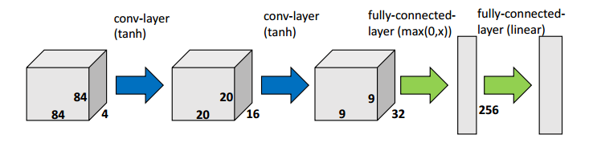

## Playing Atari with Deep Reinforcement Learning

### Reminders
- Perceptual aliasing - inability to infer the correct state from the current observation
- Restricted Boltzmann Machine (RBM) - similar to autoencoders, but forward and backward weights are the same
$$H = f(XW),\qquad \hat{X} = g(HW^T)$$

### Overview

- DL (esp. ImageNet) advances allowed efficient high level features
- DL challenges of RL:
    - need labeled data (rewards) - which are usually sparse and delayed
    - data not i.i.d. and the distribution changes
- Model-free, off-policy, $\epsilon$-greedy
- State partially observed, and often perceptually aliased. It could be represented as the full history of observations, but that would make the input huge (high dim already) and varrying in size
- Minimise $L_i(\theta_i) = \mathbb{E}\left[(y_i - Q(s, a | \theta_i)^2 \right]$, where $i$ represents each "iteration" and $y_i=\mathbb{E}\left[ r + \gamma \max_{a'} Q(s', a'| \theta_{i-1})\right]$ (note the $i-1$ signifying the previous approx)
- NN possibilities:
    - Input (s, a), output: $\hat{Q}(s,a)$ - problem: scales linearly in number of actions
    - Input s, output: $\hat{Q}(s,a)$ for each possible $a$ - much better, but only possible for discrete actions
- Network architecture (image from [1])

- Performance metrics:
    - Average total reward - quite noisy
    - Action-value estimate for random states (sampled on the initial run) - smoother

### Key ingredients
- Experience replay:
    - Randomly sample previous transitions to handle non i.i.d. data and changing distribution
    - Only perform SGD on the samples from the replay buffer, not the current transition
- Target network $y_i$ is kept fixed for better stability
- Transform the whole observation history (state representation) using the function $\phi$ - keeps the last 4 frames
- Using each 4th or 3rd (Space Invaders) frame and applying the same action for all the next skipped frames
- Reward adjustment to generalize across multiple games (1 or -1)

### Comments
- Generalizes to all Atari 2600 games within the Atari Learning Environment (ALE)
- Beats state of the art in **all** (7) of the games tested, except Space Invaders for which the state of the art uses different color channels (easier to learn object map)
- Possible improvements:
    - Smarter state sampling from the replay buffer
    - Better reward handling, since currently they are discretized to $\pm 1$
    - Learn long term strategies
- Around 50 million steps required for training [2]

[1] *Deep Learning for Real-Time Atari Game Play Using Offline Monte-Carlo Tree Search Planning*, X. Guo, et. al.
[2] *Continuous Control With Deep Reinforcement Learning*, T. P. Lillicrap, et. al.